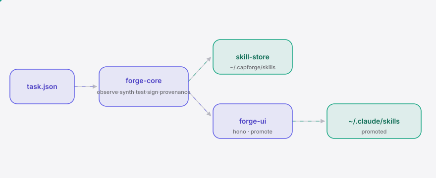
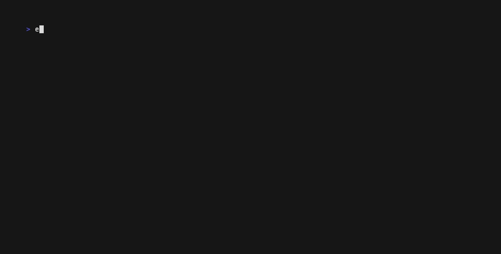

<div align="right"><sub><b>EN</b>&nbsp;&nbsp;⇄&nbsp;&nbsp;<a href="./README.zh-CN.md">中文</a></sub></div>

<picture>
  <source media="(prefers-color-scheme: dark)" srcset="./assets/hero-dark.svg">
  <source media="(prefers-color-scheme: light)" srcset="./assets/hero-light.svg">
  
</picture>

<p align="center"><sub>capforge is the skill forge that synthesizes tested, signed skills for agentic coding agents.</sub></p>

<p align="center">
  <a href="./LICENSE"></a>
  <a href="https://github.com/SuperMarioYL/capforge/releases/latest"></a>
  <a href="https://github.com/SuperMarioYL/capforge/actions/workflows/ci.yml"></a>
  
  
  
</p>

**When your agent has 1,935+ skills and still fails — capforge forges the one it's missing, tests it, signs it, and promotes it to your library.**

<h2> Architecture</h2>

<picture>
  <source media="(prefers-color-scheme: dark)" srcset="./assets/atlas-dark.svg">
  <source media="(prefers-color-scheme: light)" srcset="./assets/atlas-light.svg">
  
</picture>

One Node binary, three logical components, no microservices, no containers:

- **forge-core** — the owned protocol: **observe** the task context → **synthesize** a candidate `SKILL.md` via your own Anthropic/OpenAI model (BYO key) → **test** it against your `example_inputs` in a temp-dir sandbox → **sign** it with local ed25519 → embed a **provenance** block. A skill that fails its own test is never signed.
- **forge-ui** — a local Hono server + single-page frontend. Visualize the loop, review the test trace + signature, and promote.
- **skill-store** — local filesystem (`~/.capforge/skills/`). No DB, no network except your own LLM API.

<h2> Why this exists</h2>

Your agent has 1,935+ skills installed ([sickn33/agentic-awesome-skills](https://github.com/sickn33/agentic-awesome-skills)) and still stalls on tasks no human curated a skill for. The installable-skill wave is at 1,300★/day ([affaan-m/ECC](https://github.com/affaan-m/ECC)) — coverage gaps are now a constant, not an edge case. Static libraries install what humans already wrote; capforge creates a skill for a task *no curated skill covers*. The unit capforge owns is the **ForgeRecord**: a tested, signed unit of agent capability — not a load-time attestation of an existing skill, but the runtime synthesis + attestation of a brand-new one. The test gates the signature, the signature makes it tamper-evident, the provenance makes it auditable.

<h2> Install & quickstart</h2>

```bash
npm i -g capforge
capforge init
capforge forge --task examples/task-slugify.json --mock
```

<details><summary>sample output</summary>

```
$ capforge forge --task examples/task-slugify.json --mock
forged skill: slugify-a-string-a3c15efc
  dir:        ~/.capforge/skills/slugify-a-string-a3c15efc
  model:      capforge-mock
  test:       PASS  (3 examples)
  signed:     ed25519 b082eed28c375762…
  sig:        f66ad7aeb1a026ea1e721eee…
  provenance: embedded in SKILL.md

  verify:     capforge verify slugify-a-string-a3c15efc
```
</details>

The `--mock` flag runs the loop without an API key (a deterministic offline synthesizer) so you can see the full forge → test → sign → provenance loop in 3 commands. Drop `--mock` and set `ANTHROPIC_API_KEY` (or `OPENAI_API_KEY`) to have your own model synthesize the skill.

<h2> Usage</h2>

```bash
# forge with your own model (BYO key, no --mock)
export ANTHROPIC_API_KEY=sk-…
capforge init
capforge forge --task my-task.json
capforge verify <id>        # reports test-pass + signature-valid
capforge list                # the capability store with test + sig badges
capforge promote <id>        # copy a signed skill into ~/.claude/skills/
capforge ui                  # local skill-forge UI on http://127.0.0.1:7777
```

A task is a small JSON describing what your agent just failed at:

```json
{
  "goal": "slugify a string",
  "available_tools": ["Bash", "Read", "Write"],
  "available_skills": [],
  "example_inputs": ["Hello World", "Foo Bar Baz!"],
  "expected_assert": "[ -n \"$OUTPUT\" ] && case \"$OUTPUT\" in *[!a-z0-9-]*) false;; esac"
}
```

| field | meaning |
|---|---|
| `goal` | what the agent failed to do |
| `available_tools` | tools the agent already has (Bash, Read, …) |
| `available_skills` | skills already installed (helps the synthesizer avoid dupes) |
| `example_inputs` | inputs the forged skill is tested against |
| `expected_assert` | shell; exit 0 with `INPUT`/`OUTPUT`/`EXIT` env = pass |

The test step runs the synthesized skill's shell wrapper against each `example_input` in a throwaway temp dir with a timeout, then evaluates `expected_assert`. A skill that fails its own test is never signed — `capforge verify` reports `signature-invalid` for it.

<h2> Demo</h2>



The 20-second loop: `init` → `forge --mock` (observe → synthesize → test → sign → provenance) → `list` → `verify` (test-pass + signature-valid) → `promote` (into `~/.claude/skills/`). Recorded with [vhs](https://github.com/charmbracelet/vhs); re-render on demand via the `demo` workflow.

<h2> Configuration</h2>

`~/.capforge/config.json` (written by `capforge init`):

| key | type | default | meaning |
|---|---|---|---|
| `provider` | `"anthropic"` \| `"openai"` \| `"auto"` | `"auto"` | which model synthesizes (`auto` picks the key that is set) |
| `model` | string \| null | `null` | override the default model id (`claude-sonnet-4-5` / `gpt-4o`) |

Environment:

| var | meaning |
|---|---|
| `ANTHROPIC_API_KEY` / `OPENAI_API_KEY` | BYO model keys, read at forge time |
| `CAPFORGE_HOME` | override `~/.capforge` (the store + keypair + config) |
| `CLAUDE_SKILLS_DIR` | override `~/.claude/skills` (the promote target) |
| `CLAUDE_CODE_VERSION` | stamped into the ForgeRecord `origin` block |

<h2> Roadmap</h2>

- [x] **m1 — synthesize**: `capforge forge --task task.json` reads the task, calls your LLM (BYO key), writes a candidate `SKILL.md`.
- [x] **m2 — test, sign, provenance**: sandbox-test against `example_inputs`, ed25519-sign, embed a `<!-- capforge:provenance -->` block; `capforge verify` reports test-pass + signature-valid.
- [x] **m3 — forge UI**: local Hono page with the capability graph + a promote-to-permanent path.
- [ ] **v0.2** — runtime hooks: auto-observe the task from inside Claude Code (no `task.json` paste).
- [ ] **v0.3** — multi-harness (Codex / Cursor / Opencode) and MCP-server / browser-tool skill types.
- [ ] **later** — forged-skill registry, cross-organization provenance graph, hosted signing service.

<h2> vs a curated skill library</h2>

| | capforge | [agentic-awesome-skills](https://github.com/sickn33/agentic-awesome-skills) |
|---|---|---|
| Creates a skill for an uncovered task | ✓ at runtime | — installs what humans curated |
| Tests the skill before use | ✓ sandbox test gates the signature | — |
| Signs + provenance-tags | ✓ ed25519, embedded in SKILL.md | — |
| Breadth out-of-the-box | — none pre-installed | ✓ 1,935+ skills |
| Curated human quality | partial (model-generated, tested) | ✓ hand-curated |
| Install UX | ✓ `npm i -g` + 3 commands | ✓ installer CLI |

Honest read: a curated library wins on breadth and curation; capforge is the long-tail backstop for the task no library covers. They compose — forge a skill, then feed it back to the library.

<h2> License</h2>

MIT — see [LICENSE](./LICENSE). Issues and PRs welcome at [SuperMarioYL/capforge](https://github.com/SuperMarioYL/capforge/issues).

## Share this

```
capforge — the agentic skill forge that synthesizes a tested, signed Skill when your agent hits a task none of its 1,935 skills cover. https://github.com/SuperMarioYL/capforge
```

<p align="center"><sub><a href="./LICENSE">MIT</a> © 2026 SuperMarioYL</sub></p>
