[English](./README.md) · [Website](https://capforge.lei6393.com) · [GitHub](https://github.com/SuperMarioYL/capforge)

<picture>
  <source media="(max-width: 600px) and (prefers-color-scheme: dark)" srcset="./assets/presentation/hero-mobile-dark.svg">
  <source media="(max-width: 600px)" srcset="./assets/presentation/hero-mobile-light.svg">
  <source media="(prefers-color-scheme: dark)" srcset="./assets/presentation/hero-dark.svg">
  
</picture>

# capforge

**把缺少的 Skill 变成可测试的产物。**

capforge 根据明确任务与示例输入生成候选 Skill，执行断言，并为成功结果签名、记录来源。

## 为什么需要它

现有 Skill 库未必覆盖眼前的任务。把任务、示例与断言写清楚，新的候选 Skill 就有了进入正式库之前必须满足的条件。

- **用示例定义成功** — 断言为生成 Skill 提供具体验收条件。
- **来源随 Skill 保存** — 签名记录包含任务、生成和测试信息。
- **运行完整离线流程** — mock 生成器无需 API 密钥。

## 架构

<picture>
  <source media="(max-width: 600px) and (prefers-color-scheme: dark)" srcset="./assets/presentation/architecture-mobile-dark.svg">
  <source media="(max-width: 600px)" srcset="./assets/presentation/architecture-mobile-light.svg">
  <source media="(prefers-color-scheme: dark)" srcset="./assets/presentation/architecture-dark.svg">
  
</picture>

intake 校验任务结构；synthesize 通过指定模型提供方或离线 mock 生成 Skill；测试器在临时目录运行示例断言。成功记录经过 Ed25519 签名后保存到本地库，verify 检查已有产物，promote 将通过的 Skill 复制到配置目标。

| 组件 | 职责 |
| --- | --- |
| `Task intake` | src/observe/intake.ts |
| `Synthesis` | src/forge/synthesize.ts |
| `Example tests` | src/forge/test.ts |
| `Signed record` | src/forge/provenance.ts |

## 安装与快速上手

使用仓库清单指定的运行时版本构建，并在仓库根目录运行示例。

```bash
git clone https://github.com/SuperMarioYL/capforge.git
cd capforge
npm ci
npm run build
```

使用随仓 slugify 任务运行离线 mock、真实 Shell 断言和签名校验，无需模型密钥。

```bash
node examples/presentation-demo.mjs
```

## 实际运行示例

<picture>
  <source media="(max-width: 600px) and (prefers-color-scheme: dark)" srcset="./assets/presentation/process-mobile-dark.svg">
  <source media="(max-width: 600px)" srcset="./assets/presentation/process-mobile-light.svg">
  <source media="(prefers-color-scheme: dark)" srcset="./assets/presentation/process-dark.svg">
  
</picture>

The recorded slugify example passes its assertions and signature verification.

```text
{
  "goal": "slugify a string",
  "inputs": [
    "Hello World",
    "Foo Bar Baz!",
    "Café Résumé"
  ],
  "test_pass": true,
  "signed": true,
  "signature_valid": true,
  "model": "capforge-mock"
}
```

完整命令与输出保存在 [docs/demo-results.json](./docs/demo-results.json). 输入和复现代码均随仓提供。


保留已有录制供参考；上方文字示例给出当前可复现的操作。

## 用法

CLI 提供以下操作。示例之外的命令需要替换成你的文件路径或标识。

```bash
node dist/index.js forge --task examples/task-slugify.json --mock
node dist/index.js list
node dist/index.js verify <id>
node dist/index.js promote <id>
node dist/index.js ui
```

## 配置

CAPFORGE_HOME 指定库、密钥和配置目录；CLAUDE_SKILLS_DIR 指定推广目标。provider/model 控制在线生成；使用相应提供方时读取 ANTHROPIC_API_KEY 或 OPENAI_API_KEY。示例使用临时库并清理自身文件。

## 集成与职责分工

<picture>
  <source media="(max-width: 600px) and (prefers-color-scheme: dark)" srcset="./assets/presentation/integrations-mobile-dark.svg">
  <source media="(max-width: 600px)" srcset="./assets/presentation/integrations-mobile-light.svg">
  <source media="(prefers-color-scheme: dark)" srcset="./assets/presentation/integrations-dark.svg">
  
</picture>

以下路径已有源码实现。按任务选择输入，并把生成的结果与项目一起保存。

| 路径 | 已实现职责 |
| --- | --- |
| task.json | Goal, tools, examples and assertion |
| Anthropic / OpenAI | Optional configured synthesis providers |
| SKILL.md | Local skill and provenance |
| Ed25519 | Artifact signature verification |
| Local UI | Review and promotion |

## 限制与后续方向

- 记录示例使用确定性 mock 生成，验证本地测试、签名和验签链路，不代表模型生成质量。
- 临时目录与超时不等同于操作系统安全沙箱；运行前应检查生成的 Shell 与断言。
- 有效签名说明产物相对密钥的完整性，不证明 Skill 安全或有用。

运行时自动观察钩子与更多工具适配是后续方向；当前流程使用显式任务输入。

## 许可与贡献

许可见 [LICENSE](./LICENSE). 反馈问题时请提供最小输入、执行命令和实际输出。
